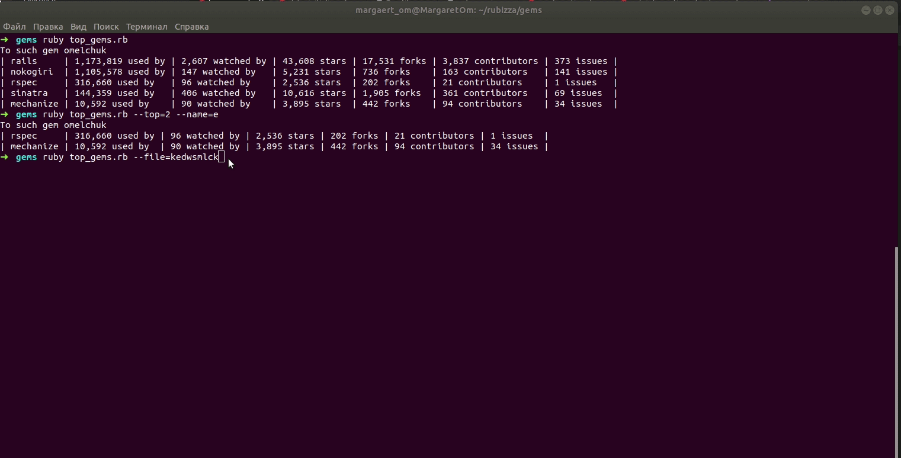

# Top Ruby gems

As part of the assignment, we write a console utility that determines the popularity of Ruby gems.
The launch is performed by the following command:

```bash
ruby top_gems.rb
```


For each gem in this list, we find it Github repo, from the page of this repo we get the following data: Used by, Watch, Star, Fork, Contributors, Issues.

We can pass additional arguments:

- The `--top` parameter, shows the number of gems according to the rating:

```bash
ruby top_gems.rb --top=2
```

- The `--name` parameter, displays all Gems according to the rating whose name includes the given word:

```bash
ruby top_gems.rb --name=active
```

- The `--file` parameter, which is the path to the yml file containing the list of gem names:

```bash
ruby top_gems.rb --file=gems.yml
```
