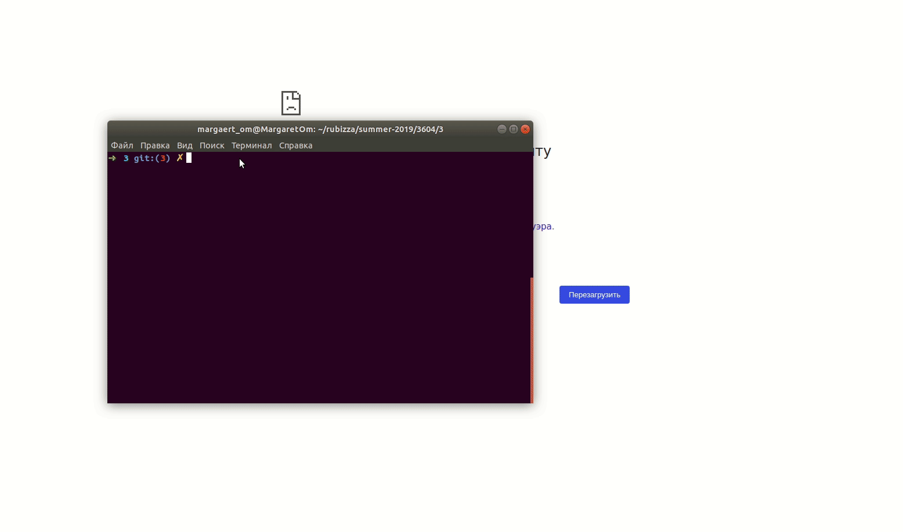

## Web site: places in city

On the main page, a list of places with a name, description and coordinates.

Leave feedback can only registered and logged in users.

## Technical description

For this assignment, used [Sinatra] (http://sinatrarb.com/). The database is sqlite.

